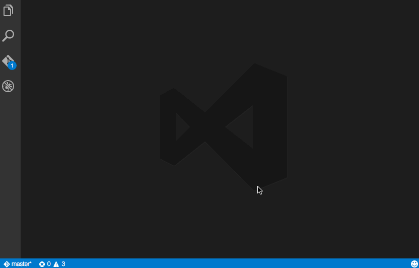

# vscode-gist

> Extension for Visual Studio Code to create, open and modify gists.
They can be anonymous, private or public and can be created from a selection or full file.



## Installation

Press <kbd>F1</kbd> and narrow down the list commands by typing `extension`. Pick `Extensions: Install Extension`.
Select the `Gist Extension` extension from the list

## Manual Install

**Mac & Linux**
```sh
cd $HOME/.vscode/extensions
```
**Windows**
```sh
cd %USERPROFILE%\.vscode\extensions
```

**All Platforms**
```
git clone https://github.com/dbankier/vscode-gist.git
cd vscode-gist
npm install
```


## Github Authentication

The plugin supports both username/password and token based authentication.

To generate a token use the following command:

**Curl**
~~~
curl -v -u USERNAME -X POST https://api.github.com/authorizations --data "{\"scopes\":[\"gist\"], \"note\": \"VSCode-Gist-Extension\"}"
~~~

**Powershell**
~~~
$base64AuthInfo = [Convert]::ToBase64String([Text.Encoding]::ASCII.GetBytes(("USERNAME:PASSWORD")))
Invoke-RestMethod -Uri "https://api.github.com/authorizations" -method post -ContentType "application/json" -Body "{""scopes"" : ""gist"",""note"":""VSCode-Gist-Extension""}" -Headers @{"Authorization"="Basic $base64AuthInfo"}
~~~

Take the token value and set the following in your `User Settings`:

~~~
"gist.oauth_token": "YOUR_TOKEN"
~~~

If value is not set, you will prompted for your password.


## Usage

### Create Gists

Press <kbd>F1</kbd> and enter one fo the following:

~~~
Gist: create new PRIVATE gist
Gist: create new ANONYMOUS gist
Gist: create new PUBLIC gist
~~~

You will be prompted a gist description.

### Open/Edit Gists

Press <kbd>F1</kbd> and enter one fo the following:

~~~
Gist: open a PERSONAL gist
Gist: open a STARRED gist
~~~

* All files associated with the gist will be opened in splits.
* Saving a **personal** gist will commit a new revision.

## Keybord Shortcut

The following are the commands that you can assign shortcuts to:

~~~
extension.privateGist
extension.publicGist
extension.anonymousGist
extension.openGist
extension.openStarredGist
~~~

None at this stage - but you can define your own.

## Future
To Do:

  * Add/Remove files from a gist.
  * Update gist description

  * Open gist revision?
  * View commits?
  * Open gist in browser?

## License

MIT © [David Bankier @dbankier](https://github.com/dbankier)
[@davidbankier](https://twitter.com/davidbankier)