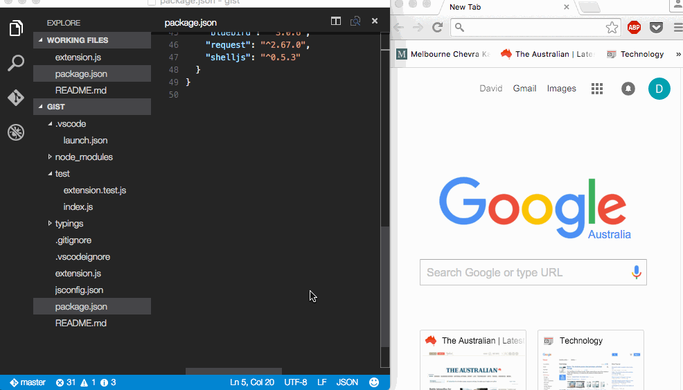

# vscode-gist

> Extension for Visual Studio Code to create gists. They can be anonoymous, private or public and can be created from selection or full file.



## Installation

Press <kbd>F1</kbd> and narrow down the list commands by typing `extension`. Pick `Extensions: Install Extension`.
Select the `Gist Extension` extension from the list

##Install Manual

**Mac & Linux**
```sh
cd $HOME/.vscode/extensions
git clone https://github.com/dbankier/vscode-gist.git
cd vscode-gist
npm install
```

**Windows**
```
cd %USERPROFILE%\.vscode\extensions
git clone https://github.com/dbankier/vscode-gist.git
cd vscode-gist
npm install
```

## Usage

**Command**

Press <kbd>F1</kbd> and type `Gist` and then select which type of gist you want to created.

You will be prompted for your git credentials and gist description if needed.

**Keybord Shortcut**

None at this stage - but you can define your own.

## Future
Other gist functions: list, view, edit, import, etc.

## License

MIT © [David Bankier @dbankier](https://github.com/dbankier)
[@davidbankier](https://twitter.com/davidbankier)